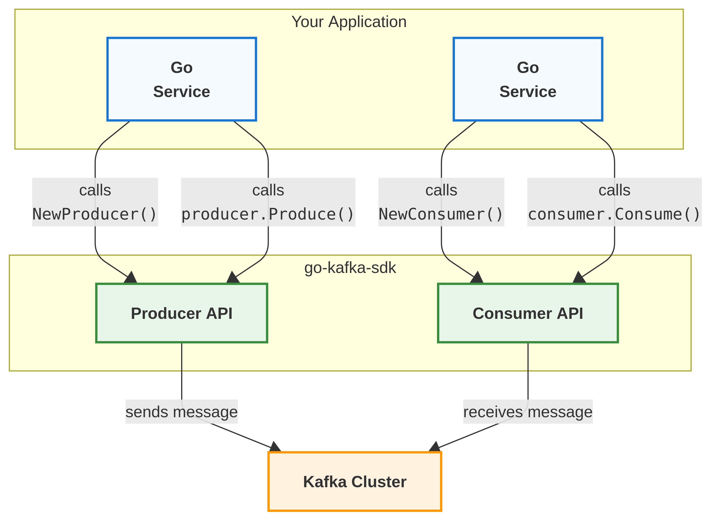

# go-kafka-sdk

A lightweight Go SDK for Apache Kafka, providing:
- Asynchronous Producer abstraction
- Multi-goroutine Consumer utilities
- Batch and single-message consumption helpers

## Architecture




## Requirements

-   Go 1.18+
-   [confluent-kafka-go](https://github.com/confluentinc/confluent-kafka-go) (as a transitive dependency)
-   A running Kafka broker (see Docker example below)

## Installation

Install dependencies:

``` sh
go get github.com/tzpereira/go-kafka-sdk/kafka
go get github.com/joho/godotenv
```

## Environment Variables

Examples can be configured using a `.env` file or environment variables:

    KAFKA_BROKERS=localhost:9092
    KAFKA_TOPICS=test-topic
    KAFKA_GROUP_ID=test-group

## Running Kafka Locally (Docker Compose)

Example `docker-compose.yml`:

``` yaml
services:
  zookeeper:
    image: confluentinc/cp-zookeeper:7.5.0
    ports:
      - "2181:2181"
    environment:
      ZOOKEEPER_CLIENT_PORT: 2181
      ZOOKEEPER_TICK_TIME: 2000

  kafka:
    image: confluentinc/cp-kafka:7.5.0
    ports:
      - "9092:9092"
    environment:
      KAFKA_BROKER_ID: 1
      KAFKA_ZOOKEEPER_CONNECT: zookeeper:2181
      KAFKA_ADVERTISED_LISTENERS: PLAINTEXT://localhost:9092
      KAFKA_OFFSETS_TOPIC_REPLICATION_FACTOR: 1
    depends_on:
      - zookeeper
```

Start Kafka:

``` sh
docker-compose up -d
```

## Usage

### Producer Example

See [`examples/producer/main.go`](examples/producer/main.go):

```go
package main

import (
    "context"
    "fmt"
    "os"
    "os/signal"
    "syscall"

    kafkasdk "github.com/tzpereira/go-kafka-sdk/kafka"
    _ "github.com/joho/godotenv/autoload"
)

func main() {
    ctx, stop := signal.NotifyContext(context.Background(), os.Interrupt, syscall.SIGTERM)
    defer stop()

    cfg := kafkasdk.NewConfigFromEnv()
    if len(cfg.Topics) == 0 {
        fmt.Println("no topics defined via KAFKA_TOPICS")
        os.Exit(1)
    }
    topic := cfg.Topics[0]

    producer, err := kafkasdk.NewProducer(cfg.Brokers, nil)
    if err != nil {
        fmt.Fprintf(os.Stderr, "failed to create producer: %v\n", err)
        os.Exit(1)
    }
    defer producer.Close()

    producer.StartDeliveryHandler(ctx, func(m *kafkasdk.Message) {
        fmt.Printf("delivered to topic %s partition %d\n", m.Topic, m.Partition)
    })

    payload := []byte("hello from go-kafka-sdk")
    fmt.Printf("Producing to topic '%s'...\n", topic)

    err = producer.Produce(ctx, &kafkasdk.Message{
        Topic: topic,
        Value: payload,
    })
    if err != nil {
        fmt.Fprintf(os.Stderr, "produce error: %v\n", err)
    }

    producer.Flush(5000)
}
```

Run:

``` sh
go run ./examples/producer
```

### Consumer Example

See [`examples/consumer/main.go`](examples/consumer/main.go):

```go
package main

import (
    "context"
    "fmt"
    "os"
    "os/signal"
    "syscall"

    kafkasdk "github.com/tzpereira/go-kafka-sdk/kafka"
    _ "github.com/joho/godotenv/autoload"
)

func main() {
    ctx, stop := signal.NotifyContext(context.Background(), os.Interrupt, syscall.SIGTERM)
    defer stop()

    cfg := kafkasdk.NewConfigFromEnv()
    consumer, err := kafkasdk.NewConsumer(cfg.Brokers, cfg.GroupID, cfg.Topics, nil)
    if err != nil {
        fmt.Fprintf(os.Stderr, "failed to create consumer: %v\n", err)
        os.Exit(1)
    }
    defer consumer.Close()

    fmt.Printf("Consuming from %v (group=%s)\n", cfg.Topics, cfg.GroupID)

    err = consumer.Consume(ctx, func(msg *kafkasdk.Message) {
        fmt.Printf("topic=%s partition=%d key=%s value=%s\n",
            msg.Topic,
            msg.Partition,
            string(msg.Key),
            string(msg.Value),
        )
    })
    if err != nil && err != context.Canceled && err != context.DeadlineExceeded {
        fmt.Fprintf(os.Stderr, "consumer error: %v\n", err)
    }
}
```

Run:

``` sh
go run ./examples/consumer
```

## Running Tests

To execute all tests (Kafka must be running on `localhost:9092`):

``` sh
go test -v ./kafka
```

## Notes

-   No brokers, topics, or consumer groups are hardcoded --- pass them via parameters or environment variables.
-   Check the source code for more advanced use cases such as batch consumption, worker pools, and custom Kafka configs.